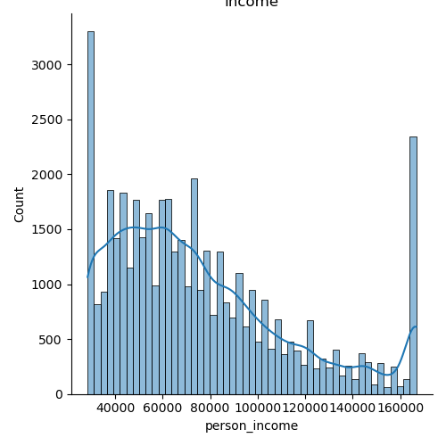
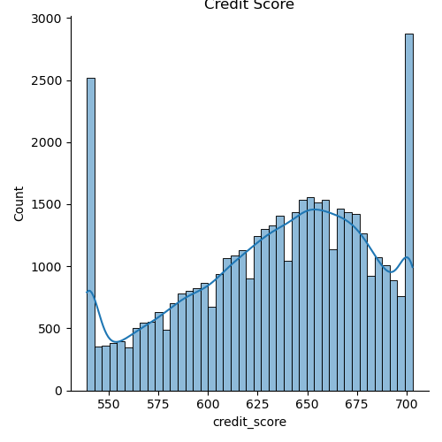
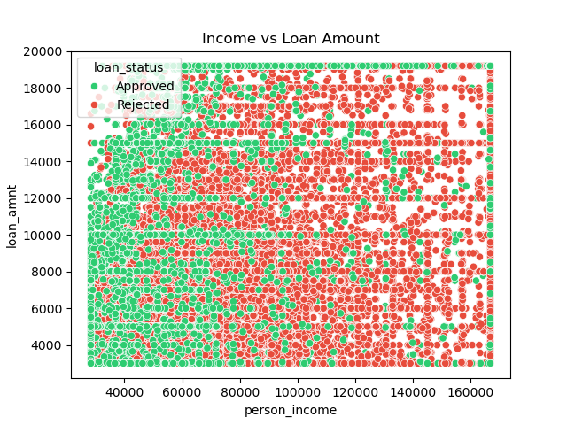
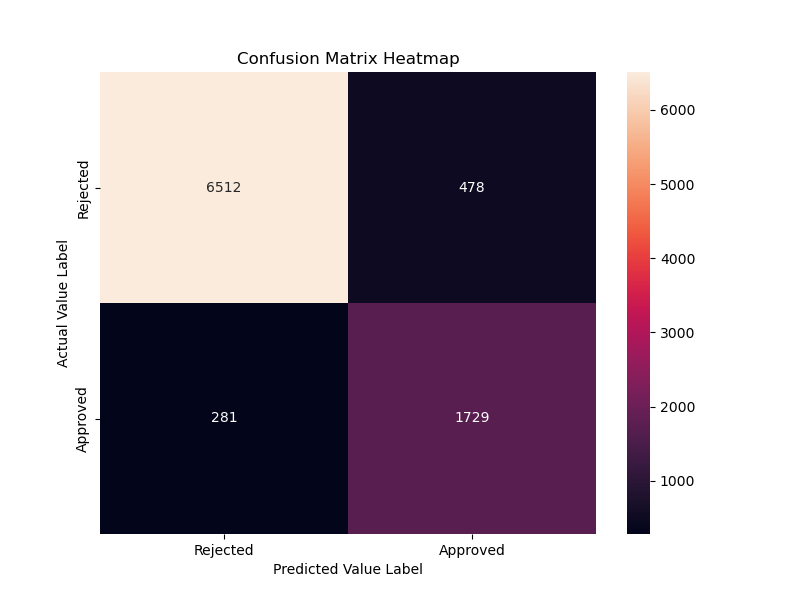

# Loan Approval Prediction
This project predicts loan approval status using machine learning classification models. 

**Data:** https://www.kaggle.com/datasets/taweilo/loan-approval-classification-data 

## Data Cleaning
    1. Capitalized the column values
    2. Outlier Removed (Age above 100 and income above 1 million)

## Feature Engineering
    1. New column added: net_disposable_income

## EDA

1. Loan Status According to Gender

2. Loan Status According to Education Qualification

3. Loan Status According to Loan Intent

4. Income Range

5. Loan Range

6. Credit Range

7. Income vs Loan Amount

8. HeatMap

## Data Processing
    1. Label Encoding is performed for categorical data
    2. Standarizaation is performed for numerical data

## Model Trainning
    1. Input Feature and Target Variable is assigned
    2. Train Test Split: 80% trainning and 20% testing
    3. Random Forest Classifier is used for trainning
        - Accuracy: 93.21% and Cross Validation: 92.54%
    4. Hyperparameter Tunning using GridSearchCV
        - Accuracy: 93.35% and Cross Validation: 92.67%
    5. Model Evaluation is performed classification Report and Confusion Matrix
    

